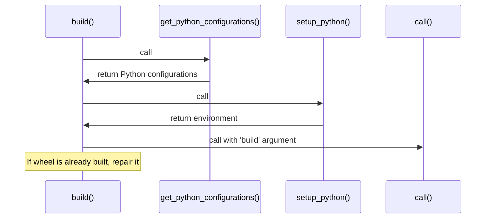

The build flow for pyodide in cibuildwheel involves several steps including reading configurations, setting up the environment, and building the wheel. Let's explore these steps in detail.

<SwmSnippet path="/cibuildwheel/pyodide.py" line="192" repo-id="Z2l0aHViJTNBJTNBY2lidWlsZHdoZWVsJTNBJTNBZ2lsYWRuYXZvdA==">

---

The <SwmToken path="cibuildwheel/pyodide.py" pos="192:2:2" line-data="def build(options: Options, tmp_path: Path) -&gt; None:" repo-id="Z2l0aHViJTNBJTNBY2lidWlsZHdoZWVsJTNBJTNBZ2lsYWRuYXZvdA==" repo-name="cibuildwheel">`build`</SwmToken> function in <SwmPath repo-id="Z2l0aHViJTNBJTNBY2lidWlsZHdoZWVsJTNBJTNBZ2lsYWRuYXZvdA==" repo-name="cibuildwheel" path="cibuildwheel/pyodide.py">`(cibuildwheel) cibuildwheel/pyodide.py`</SwmPath> is the main entry point for the build process. It starts by getting the Python configurations for the build, then it sets up the environment and finally builds the wheel.

```python
def build(options: Options, tmp_path: Path) -> None:
    python_configurations = get_python_configurations(
        options.globals.build_selector, options.globals.architectures
    )

    if not python_configurations:
        return

    try:
        before_all_options_identifier = python_configurations[0].identifier
        before_all_options = options.build_options(before_all_options_identifier)

        if before_all_options.before_all:
            log.step("Running before_all...")
            env = before_all_options.environment.as_dictionary(prev_environment=os.environ)
            before_all_prepared = prepare_command(
                before_all_options.before_all, project=".", package=before_all_options.package_dir
            )
            shell(before_all_prepared, env=env)

        built_wheels: list[Path] = []
```

---

</SwmSnippet>

<SwmSnippet path="/cibuildwheel/pyodide.py" line="181" repo-id="Z2l0aHViJTNBJTNBY2lidWlsZHdoZWVsJTNBJTNBZ2lsYWRuYXZvdA==">

---

The <SwmToken path="cibuildwheel/pyodide.py" pos="181:2:2" line-data="def get_python_configurations(" repo-id="Z2l0aHViJTNBJTNBY2lidWlsZHdoZWVsJTNBJTNBZ2lsYWRuYXZvdA==" repo-name="cibuildwheel">`get_python_configurations`</SwmToken> function is used to read the Python configurations for the build. It uses the <SwmToken path="cibuildwheel/pyodide.py" pos="185:5:5" line-data="    full_python_configs = read_python_configs(&quot;pyodide&quot;)" repo-id="Z2l0aHViJTNBJTNBY2lidWlsZHdoZWVsJTNBJTNBZ2lsYWRuYXZvdA==" repo-name="cibuildwheel">`read_python_configs`</SwmToken> function to read the configurations from the <SwmPath repo-id="Z2l0aHViJTNBJTNBY2lidWlsZHdoZWVsJTNBJTNBZ2lsYWRuYXZvdA==" repo-name="cibuildwheel" path="cibuildwheel/resources/build-platforms.toml">`(cibuildwheel) cibuildwheel/resources/build-platforms.toml`</SwmPath> file.

```python
def get_python_configurations(
    build_selector: BuildSelector,
    architectures: Set[Architecture],  # noqa: ARG001
) -> list[PythonConfiguration]:
    full_python_configs = read_python_configs("pyodide")

    python_configurations = [PythonConfiguration(**item) for item in full_python_configs]
    python_configurations = [c for c in python_configurations if build_selector(c.identifier)]
    return python_configurations
```

---

</SwmSnippet>

<SwmSnippet path="/cibuildwheel/pyodide.py" line="111" repo-id="Z2l0aHViJTNBJTNBY2lidWlsZHdoZWVsJTNBJTNBZ2lsYWRuYXZvdA==">

---

The <SwmToken path="cibuildwheel/pyodide.py" pos="110:2:2" line-data="def setup_python(" repo-id="Z2l0aHViJTNBJTNBY2lidWlsZHdoZWVsJTNBJTNBZ2lsYWRuYXZvdA==" repo-name="cibuildwheel">`setup_python`</SwmToken> function is used to set up the Python environment for the build. It uses the <SwmToken path="cibuildwheel/pyodide.py" pos="24:1:1" line-data="    call," repo-id="Z2l0aHViJTNBJTNBY2lidWlsZHdoZWVsJTNBJTNBZ2lsYWRuYXZvdA==" repo-name="cibuildwheel">`call`</SwmToken> function to execute the <SwmToken path="cibuildwheel/pyodide.py" pos="185:8:8" line-data="    full_python_configs = read_python_configs(&quot;pyodide&quot;)" repo-id="Z2l0aHViJTNBJTNBY2lidWlsZHdoZWVsJTNBJTNBZ2lsYWRuYXZvdA==" repo-name="cibuildwheel">`pyodide`</SwmToken> command with the <SwmToken path="cibuildwheel/pyodide.py" pos="73:8:8" line-data="        / f&quot;.pyodide-xbuildenv-{pyodide_version}/{pyodide_version}/xbuildenv/pyodide-root&quot;" repo-id="Z2l0aHViJTNBJTNBY2lidWlsZHdoZWVsJTNBJTNBZ2lsYWRuYXZvdA==" repo-name="cibuildwheel">`xbuildenv`</SwmToken> argument.

```python
    tmp: Path,
    python_configuration: PythonConfiguration,
    dependency_constraint_flags: Sequence[PathOrStr],
    environment: ParsedEnvironment,
) -> dict[str, str]:
    base_python = get_base_python(python_configuration.identifier)

    log.step("Setting up build environment...")
    venv_path = tmp / "venv"
    env = virtualenv(python_configuration.version, base_python, venv_path, [], use_uv=False)
    venv_bin_path = venv_path / "bin"
    assert venv_bin_path.exists()
```

---

</SwmSnippet>

<SwmSnippet path="/cibuildwheel/pyodide.py" line="264" repo-id="Z2l0aHViJTNBJTNBY2lidWlsZHdoZWVsJTNBJTNBZ2lsYWRuYXZvdA==">

---

The wheel is built using the <SwmToken path="cibuildwheel/pyodide.py" pos="24:1:1" line-data="    call," repo-id="Z2l0aHViJTNBJTNBY2lidWlsZHdoZWVsJTNBJTNBZ2lsYWRuYXZvdA==" repo-name="cibuildwheel">`call`</SwmToken> function with the <SwmToken path="cibuildwheel/pyodide.py" pos="267:36:36" line-data="                    f&quot;\nFound previously built wheel {compatible_wheel.name}, that&#39;s compatible with {config.identifier}. Skipping build step...&quot;" repo-id="Z2l0aHViJTNBJTNBY2lidWlsZHdoZWVsJTNBJTNBZ2lsYWRuYXZvdA==" repo-name="cibuildwheel">`build`</SwmToken> argument. If the wheel is already built, it is repaired using the <SwmToken path="cibuildwheel/pyodide.py" pos="304:5:5" line-data="                if build_options.repair_command:" repo-id="Z2l0aHViJTNBJTNBY2lidWlsZHdoZWVsJTNBJTNBZ2lsYWRuYXZvdA==" repo-name="cibuildwheel">`repair_command`</SwmToken>.

```python
            if compatible_wheel:
                log.step_end()
                print(
                    f"\nFound previously built wheel {compatible_wheel.name}, that's compatible with {config.identifier}. Skipping build step..."
                )
                built_wheel = compatible_wheel
            else:
                if build_options.before_build:
                    log.step("Running before_build...")
                    before_build_prepared = prepare_command(
                        build_options.before_build, project=".", package=build_options.package_dir
                    )
                    shell(before_build_prepared, env=env)

                log.step("Building wheel...")

                extra_flags = split_config_settings(build_options.config_settings, "build")
                extra_flags += build_frontend.args

                if not 0 <= build_options.build_verbosity < 2:
                    msg = f"build_verbosity {build_options.build_verbosity} is not supported for build frontend. Ignoring."
```

---

</SwmSnippet>

Here is a visualization:



<SwmMeta version="3.0.0"><sup>Powered by [Swimm](/)</sup></SwmMeta>
