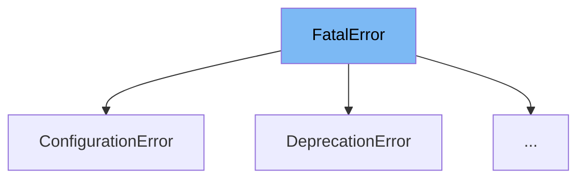

This document will cover the <SwmToken path="/cibuildwheel/errors.py" pos="8:2:2" line-data="class FatalError(BaseException):">`FatalError`</SwmToken> class in the cibuildwheel project. We'll cover:

1. What is <SwmToken path="/cibuildwheel/errors.py" pos="8:2:2" line-data="class FatalError(BaseException):">`FatalError`</SwmToken>
2. Variables and functions in <SwmToken path="/cibuildwheel/errors.py" pos="8:2:2" line-data="class FatalError(BaseException):">`FatalError`</SwmToken>
3. An example of how to use <SwmToken path="/cibuildwheel/errors.py" pos="8:2:2" line-data="class FatalError(BaseException):">`FatalError`</SwmToken>



# What is <SwmToken path="/cibuildwheel/errors.py" pos="8:2:2" line-data="class FatalError(BaseException):">`FatalError`</SwmToken>

<SwmToken path="/cibuildwheel/errors.py" pos="8:2:2" line-data="class FatalError(BaseException):">`FatalError`</SwmToken> is a custom exception class in the cibuildwheel project. It is designed to handle errors that can cause the build to fail. When an error of this type is raised, the error message is printed to stderr and the process is terminated. This provides a better error message and optional traceback within cibuildwheel.

<SwmSnippet path="/cibuildwheel/errors.py" line="15">

---

# Variables and functions

<SwmToken path="/cibuildwheel/errors.py" pos="15:1:1" line-data="    return_code: int = 1">`return_code`</SwmToken> is a class variable in <SwmToken path="/cibuildwheel/errors.py" pos="8:2:2" line-data="class FatalError(BaseException):">`FatalError`</SwmToken> that stores the return code of the error. It is an integer and its default value is 1.

```python
    return_code: int = 1
```

---

</SwmSnippet>

<SwmSnippet path="/cibuildwheel/errors.py" line="18">

---

# Usage example

<SwmToken path="/cibuildwheel/errors.py" pos="18:2:2" line-data="class ConfigurationError(FatalError):">`ConfigurationError`</SwmToken> is an example of how <SwmToken path="/cibuildwheel/errors.py" pos="8:2:2" line-data="class FatalError(BaseException):">`FatalError`</SwmToken> is used. It is a subclass of <SwmToken path="/cibuildwheel/errors.py" pos="8:2:2" line-data="class FatalError(BaseException):">`FatalError`</SwmToken> and it overrides the <SwmToken path="/cibuildwheel/errors.py" pos="19:1:1" line-data="    return_code = 2">`return_code`</SwmToken> variable with a value of 2.

```python
class ConfigurationError(FatalError):
    return_code = 2
```

---

</SwmSnippet>

&nbsp;

*This is an auto-generated document by Swimm AI 🌊 and has not yet been verified by a human*

<SwmMeta version="3.0.0" repo-id="Z2l0aHViJTNBJTNBY2lidWlsZHdoZWVsJTNBJTNBZ2lsYWRuYXZvdA==" repo-name="cibuildwheel"><sup>Powered by [Swimm](https://app.swimm.io/)</sup></SwmMeta>
