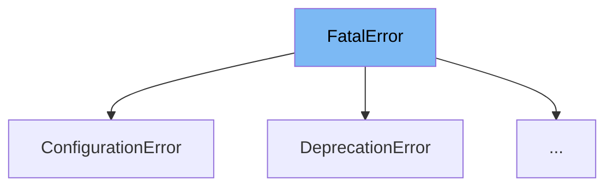

This document will cover the `FatalError` class in the cibuildwheel project. We'll cover:

1. What is `FatalError`.
2. Variables and functions in `FatalError`.
3. An example of how to use `FatalError`.



# What is FatalError

`FatalError` is a custom exception class in the cibuildwheel project. It is a subclass of `BaseException` and is designed to handle errors that can cause the build to fail. When an error of this type is raised, the error message is printed to stderr and the process is terminated. This provides a better error message and optional traceback within the cibuildwheel project.

<SwmSnippet path="/cibuildwheel/errors.py" line="15">

---

# Variables and functions

`return_code` is a class variable in `FatalError` that stores the return code for the error. It is an integer and its default value is 1.

```python
    return_code: int = 1
```

---

</SwmSnippet>

<SwmSnippet path="/cibuildwheel/errors.py" line="18">

---

# Usage example

`ConfigurationError` is an example of a class that extends `FatalError`. It overrides the `return_code` variable and sets its value to 2.

```python
class ConfigurationError(FatalError):
    return_code = 2
```

---

</SwmSnippet>

&nbsp;

*This is an auto-generated document by Swimm AI 🌊 and has not yet been verified by a human*

<SwmMeta version="3.0.0" repo-id="Z2l0aHViJTNBJTNBY2lidWlsZHdoZWVsJTNBJTNBZ2lsYWRuYXZvdA==" repo-name="cibuildwheel" doc-type="class"><sup>Powered by [Swimm](/)</sup></SwmMeta>
