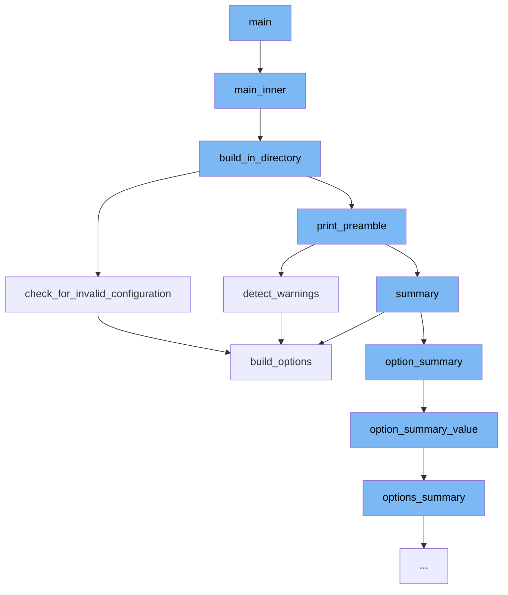

This document will cover the process of building Python wheels using the cibuildwheel tool, which includes:

1. Initializing the build process
2. Building in a specified directory
3. Checking for invalid configurations
4. Detecting warnings
5. Summarizing build options.



<SwmSnippet path="/cibuildwheel/__main__.py" line="63">

---

# Initializing the build process

The function `main_inner` initializes the build process. It parses the command line arguments and sets up the necessary parameters for the build. Depending on the arguments, it either builds in the current directory or extracts a tarfile and builds in the extracted directory.

```python
def main_inner(global_options: GlobalOptions) -> None:
    """
    `main_inner` is the same as `main`, but it raises FatalError exceptions
    rather than exiting directly.
    """

    parser = argparse.ArgumentParser(
        description="Build wheels for all the platforms.",
        epilog="""
            Most options are supplied via environment variables or in
            --config-file (pyproject.toml usually). See
            https://github.com/pypa/cibuildwheel#options for info.
        """,
    )

    parser.add_argument(
        "--platform",
        choices=["auto", "linux", "macos", "windows", "pyodide"],
        default=None,
        help="""
            Platform to build for. Use this option to override the
```

---

</SwmSnippet>

<SwmSnippet path="/cibuildwheel/__main__.py" line="287">

---

# Building in a specified directory

The function `build_in_directory` is responsible for building the wheels in a specified directory. It computes the build options, checks for invalid configurations, and if everything is valid, it starts the build process.

```python
def build_in_directory(args: CommandLineArguments) -> None:
    platform: PlatformName = _compute_platform(args)
    if platform == "pyodide" and sys.platform == "win32":
        msg = "cibuildwheel: Building for pyodide is not supported on Windows"
        print(msg, file=sys.stderr)
        sys.exit(2)

    options = compute_options(platform=platform, command_line_arguments=args, env=os.environ)

    package_dir = options.globals.package_dir
    package_files = {"setup.py", "setup.cfg", "pyproject.toml"}

    if not any(package_dir.joinpath(name).exists() for name in package_files):
        names = ", ".join(sorted(package_files, reverse=True))
        msg = f"Could not find any of {{{names}}} at root of package"
        raise errors.ConfigurationError(msg)

    platform_module = get_platform_module(platform)
    identifiers = get_build_identifiers(
        platform_module=platform_module,
        build_selector=options.globals.build_selector,
```

---

</SwmSnippet>

<SwmSnippet path="/cibuildwheel/options.py" line="702">

---

# Checking for invalid configurations

The function `check_for_invalid_configuration` checks if the build configuration is valid. It raises an error if multiple values are set for `before_all` on macOS and Windows platforms.

```python
    def check_for_invalid_configuration(self, identifiers: Iterable[str]) -> None:
        if self.platform in {"macos", "windows"}:
            before_all_values = {self.build_options(i).before_all for i in identifiers}

            if len(before_all_values) > 1:
                raise ValueError(
                    unwrap(
                        f"""
                        before_all cannot be set to multiple values. On macOS and Windows,
                        before_all is only run once, at the start of the build. before_all values
                        are: {before_all_values!r}
                        """
                    )
                )
```

---

</SwmSnippet>

<SwmSnippet path="/cibuildwheel/__main__.py" line="403">

---

# Detecting warnings

The function `detect_warnings` checks for deprecated `{python}` and `{pip}` in the `test_command` and `before_build` options and adds a warning if they are found.

```python
def detect_warnings(*, options: Options, identifiers: Iterable[str]) -> list[str]:
    warnings = []

    # warn about deprecated {python} and {pip}
    for option_name in ["test_command", "before_build"]:
        option_values = [getattr(options.build_options(i), option_name) for i in identifiers]

        if any(o and ("{python}" in o or "{pip}" in o) for o in option_values):
            # Reminder: in an f-string, double braces means literal single brace
            msg = (
                f"{option_name}: '{{python}}' and '{{pip}}' are no longer needed, "
                "and will be removed in a future release. Simply use 'python' or 'pip' instead."
            )
            warnings.append(msg)

    return warnings
```

---

</SwmSnippet>

<SwmSnippet path="/cibuildwheel/options.py" line="563">

---

# Summarizing build options

The function `build_options` computes the build options for a single run configuration. It reads the configuration from the environment and command line arguments, and constructs a `BuildOptions` object.

```python
    def build_options(self, identifier: str | None) -> BuildOptions:
        """
        Compute BuildOptions for a single run configuration.
        """

        with self.reader.identifier(identifier):
            before_all = self.reader.get("before-all", list_sep=" && ")

            environment_config = self.reader.get(
                "environment", table_format={"item": '{k}="{v}"', "sep": " "}
            )
            environment_pass = self.reader.get("environment-pass", list_sep=" ").split()
            before_build = self.reader.get("before-build", list_sep=" && ")
            repair_command = self.reader.get("repair-wheel-command", list_sep=" && ")
            config_settings = self.reader.get(
                "config-settings",
                table_format={"item": "{k}={v}", "sep": " ", "quote": shlex.quote},
            )

            dependency_versions = self.reader.get("dependency-versions")
            test_command = self.reader.get("test-command", list_sep=" && ")
```

---

</SwmSnippet>

&nbsp;

*This is an auto-generated document by Swimm AI 🌊 and has not yet been verified by a human*

<SwmMeta version="3.0.0" repo-id="Z2l0aHViJTNBJTNBY2lidWlsZHdoZWVsJTNBJTNBZ2lsYWRuYXZvdA==" repo-name="cibuildwheel" doc-type="flows"><sup>Powered by [Swimm](/)</sup></SwmMeta>
