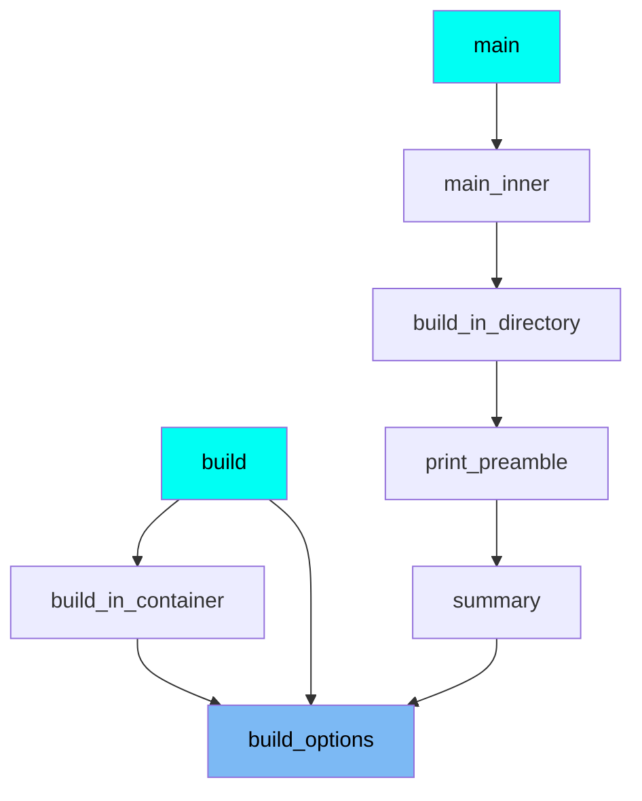
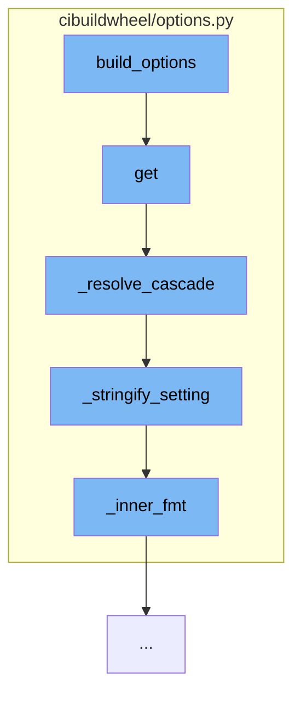

This document will cover the process of resolving configuration options in cibuildwheel, which includes:

1. Fetching the named option
2. Resolving the cascade of values
3. Stringifying the setting
4. Formatting the inner values.

## Where is this flow used?

The flow starts with the function `build_options`. It is called from multiple entry points as represented in the following diagram:



## The flow itself



<SwmSnippet path="/cibuildwheel/options.py" line="410">

---

# Fetching the named option

The function `get` is used to fetch the value for the named option from the environment, configuration file, or the default. It handles different types of values such as arrays and tables, and also provides the option to ignore empty variables.

```python
    def get(
        self,
        name: str,
        *,
        env_plat: bool = True,
        list_sep: str | None = None,
        table_format: TableFmt | None = None,
        ignore_empty: bool = False,
    ) -> str:
        """
        Get and return the value for the named option from environment,
        configuration file, or the default. If env_plat is False, then don't
        accept platform versions of the environment variable. If this is an
        array it will be merged with "sep" before returning. If it is a table,
        it will be formatted with "table['item']" using {k} and {v} and merged
        with "table['sep']". If sep is also given, it will be used for arrays
        inside the table (must match table['sep']). Empty variables will not
        override if ignore_empty is True.
        """

        if name not in self.default_options and name not in self.default_platform_options:
```

---

</SwmSnippet>

<SwmSnippet path="/cibuildwheel/options.py" line="162">

---

# Resolving the cascade of values

The function `_resolve_cascade` is used to resolve a cascade of values with inherit rules into a single value. It handles different types of values and provides the option to ignore empty values.

```python
def _resolve_cascade(
    *pairs: tuple[Setting | None, InheritRule],
    ignore_empty: bool = False,
    list_sep: str | None = None,
    table_format: TableFmt | None = None,
) -> str:
    """
    Given a cascade of values with inherit rules, resolve them into a single
    value.

    'None' values mean that the option was not set at that level, and are
    ignored. If `ignore_empty` is True, empty values are ignored too.

    Values start with defaults, followed by more specific rules. If rules are
    NONE, the last non-null value is returned. If a rule is APPEND or PREPEND,
    the value is concatenated with the previous value.

    The following idiom can be used to get the first matching value:

        _resolve_cascade(("value1", Inherit.NONE), ("value2", Inherit.NONE), ...)))
    """
```

---

</SwmSnippet>

<SwmSnippet path="/cibuildwheel/options.py" line="245">

---

# Stringifying the setting

The function `_stringify_setting` is used to convert the setting into a string. It handles different types of settings such as mappings, sequences, booleans, and integers.

```python
def _stringify_setting(
    setting: Setting, list_sep: str | None, table_format: TableFmt | None
) -> str:
    if isinstance(setting, Mapping):
        if table_format is None:
            msg = f"Error converting {setting!r} to a string: this setting doesn't accept a table"
            raise ConfigOptionError(msg)
        return table_format["sep"].join(
            item for k, v in setting.items() for item in _inner_fmt(k, v, table_format)
        )

    if not isinstance(setting, str) and isinstance(setting, Sequence):
        if list_sep is None:
            msg = f"Error converting {setting!r} to a string: this setting doesn't accept a list"
            raise ConfigOptionError(msg)
        return list_sep.join(setting)

    if isinstance(setting, (bool, int)):
        return str(setting)

    return setting
```

---

</SwmSnippet>

<SwmSnippet path="/cibuildwheel/options.py" line="457">

---

# Formatting the inner values

The function `_inner_fmt` is used to format the inner values of a table. It handles different types of values such as lists and booleans.

```python
def _inner_fmt(k: str, v: Any, table: TableFmt) -> Iterator[str]:
    quote_function = table.get("quote", lambda a: a)

    if isinstance(v, list):
        for inner_v in v:
            qv = quote_function(inner_v)
            yield table["item"].format(k=k, v=qv)
    elif isinstance(v, bool):
        qv = quote_function(str(v))
        yield table["item"].format(k=k, v=qv)
    else:
        qv = quote_function(v)
        yield table["item"].format(k=k, v=qv)
```

---

</SwmSnippet>

&nbsp;

*This is an auto-generated document by Swimm AI 🌊 and has not yet been verified by a human*

<SwmMeta version="3.0.0" repo-id="Z2l0aHViJTNBJTNBY2lidWlsZHdoZWVsJTNBJTNBZ2lsYWRuYXZvdA==" repo-name="cibuildwheel" doc-type="flows"><sup>Powered by [Swimm](/)</sup></SwmMeta>
